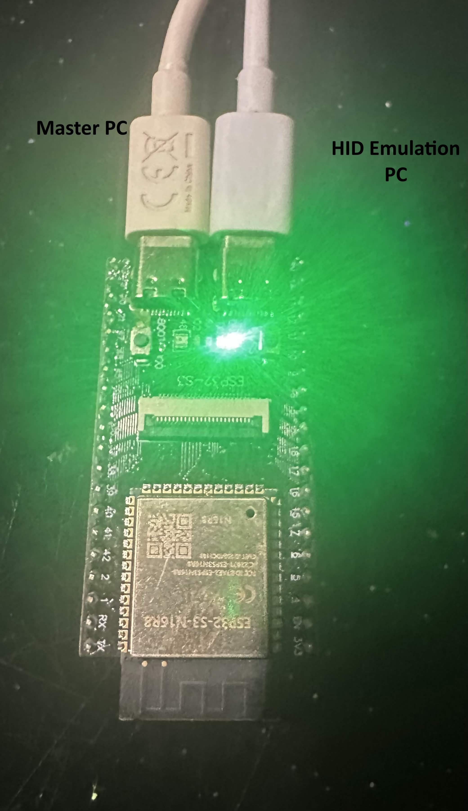

# Kavix32

Kavix32 forwards keyboard and mouse input from a **Master PC** to an **Emulation Client PC** through an ESP32-S3.

~~~text
Master PC                         ESP32-S3                         Emulation Client PC
(captures input)  -- serial -->  (Kavix32 firmware)  -- USB HID --> (receives emulated input)
~~~

The Master PC runs the Kavix32 UI and input-capture runtime. The ESP32-S3 appears to the Emulation Client PC as a normal USB keyboard and mouse. Clipboard mode optionally adds a small Python script on the Emulation Client PC.

## 1. Setup

### What you need

- An ESP32-S3 board whose native USB port supports USB device/OTG mode.
- Two data-capable USB cables:
  - Master PC → the board's serial/programming connection.
  - Board's native USB device port → Emulation Client PC.
- A Windows Master PC with Python 3.
- ESP-IDF installed for the firmware build and flash step.
- For Clipboard mode only: Python 3 on the Emulation Client PC.

The Master PC is where keyboard and mouse input is captured. The Emulation Client PC is where that input is emulated. These are separate roles throughout this guide.

### Port connections

With the board facing away from you, as shown above:

1. Connect the left USB port to the Master PC first.
2. Connect the right USB port to the Emulation Client PC second.

> Use data-capable USB cables. Do not connect two computers to the same USB connector.

### 3D-printable enclosure

There is a 3d printable enclosure in the hardware\enclosure directory for the esp S3 to make it look nice :D

### A. Flash the firmware

1. Open an **ESP-IDF PowerShell** session.
2. Connect the left USB port to the Master PC.
3. Identify its serial port, then run the following from the repository root. Replace `COM7` with the port for your board.

~~~powershell
cd .\firmware
idf.py set-target esp32s3
.\flash_firmware.ps1 -Port COM7
~~~

The flash helper builds the firmware, erases the board, then writes the fresh firmware at `460800` baud. To preserve the existing flash contents while updating firmware, add `-SkipErase`:

~~~powershell
.\flash_firmware.ps1 -Port COM7 -SkipErase
~~~

To view firmware logs:

~~~powershell
idf.py -p COM7 monitor
~~~

### B. Set up the Master PC

From the repository root:

~~~powershell
cd .\master_pc_client\main
py -3 -m pip install -r requirements.txt
py -3 .\switcher_ui.py
~~~

If the Python launcher is not installed, replace `py -3` with the path to your Python executable.

On first launch:

1. Select the Master PC serial port connected to the ESP32-S3.
2. Keep the baud rate at `460800`.
3. Select **Passive mode** for HID-only forwarding, or **Clipboard mode** if you will also run the Emulation Client PC script below.
4. Choose your capture-toggle combination. The public default is `ctrl+f1`.
5. Click **Check**. It should confirm that the firmware is connected.
6. Click **Start**, then press the capture toggle to enable or disable input forwarding.

You can run the Master PC runtime without the UI:

~~~powershell
py -3 .\master_pc_client.py --settings .\config.json --port COM7 --verbose
~~~

### C. Connect the Emulation Client PC

Connect the right USB port to the Emulation Client PC after the Master PC connection is in place.

- In **Passive mode**, nothing needs to be installed on the Emulation Client PC. It should enumerate the board as a USB keyboard and mouse.
- In **Clipboard mode**, run the matching script below as well. The script is a console Python program; there is intentionally no HID-client UI, launcher, installer, or separate setup package.

#### Windows Emulation Client PC

~~~powershell
cd .\hid_pc_client\windows\main
py -3 -m pip install -r requirements.txt
py -3 .\hid_pc_client.py
~~~

Closing the console keeps the script running in the Windows notification area. Right-click its Kavix32 icon and choose **Exit** to stop it.

#### Debian/Linux Emulation Client PC

~~~bash
cd ./hid_pc_client/debian/main
python3 -m pip install -r requirements.txt
python3 ./hid_pc_client.py
~~~

With an empty `serial_port`, the scripts use the only detected serial port. If there are several, they ask which one to use and list detected Kavix32/ESP32 ports first. Set `serial_port` explicitly to skip the prompt:

~~~json
{ "serial_port": "COM9" }
~~~

Use a Linux path such as `/dev/ttyACM0` instead of `COM9` on Debian/Linux. Linux clipboard syncing needs a clipboard backend: install `wl-clipboard` on Wayland, or `xclip`/`xsel` on X11 if none is already present.

### D. Verify the complete setup

1. The Master PC UI's **Check** control should report that the ESP32-S3 firmware is reachable.
2. Enable capture with the configured hotkey.
3. On the Emulation Client PC, test a key, mouse movement, a click, and scrolling.
4. If using Clipboard mode, copy short text on one computer and confirm it arrives on the other.

## 2. Master PC UI

### Basic Setup

- **Serial** — select the COM port connected to the ESP32-S3. The baud rate is fixed at `460800` because the firmware uses the same rate.
- **Device status check** — **Check** probes the connected board and reports whether the firmware and, in Clipboard mode, the Emulation Client PC script are ready.
- **Capture** — choose the key combination that enables or disables forwarding. The runtime always starts with capture disabled, so it will not take over input unexpectedly.
- **Forwarding mode**
  - **Passive mode:** forwards keyboard and mouse through the ESP32-S3 only. No Kavix32 software runs on the Emulation Client PC.
  - **Clipboard mode:** keeps the same HID forwarding and additionally synchronizes text clipboard data through the board's USB CDC serial interface. The Emulation Client PC script is required.
- **Keyboard profiles** — select or add a remapping profile. The checked-in configuration starts with a neutral US profile.
- **Windows keyboard layout** — when enabled, the Master PC runtime follows the currently active Windows keyboard layout and applies the matching profile when available.
- **Start on boot in background** — Doesnt work currently
- **Theme** — switches between light and dark presentation. This does not affect capture or forwarding.

### Runtime tab

The **Runtime** tab shows the output of the Master PC capture process.

- **Start** launches `master_pc_client.py` with the currently selected configuration.
- **Stop** ends that process and releases capture.
- **Restart** stops and starts it again after a setting change.
- **Clear** clears only the visible log output.

### Configuration files

The UI reads and writes `master_pc_client/main/config.json`.

| Setting | Purpose |
| --- | --- |
| `serial.port` | Master PC serial port for the ESP32-S3. |
| `serial.baud` | Serial link speed; keep `460800`. |
| `capture.enabled_by_default` | Whether capture starts immediately; the public default is `false`. |
| `capture.toggle_combo` | Key combination used to enable or disable forwarding. |
| `sharing.mode` | `passive` or `clipboard`. |
| `keyboard.layout` | The active keyboard remapping profile. |
| `keyboard.layouts` | Profiles available in the UI. |
| `keyboard.layout_profiles` | Key remapping rules per profile. |
| `keyboard.use_windows_layout` | Follow the active Windows keyboard layout when true. |
| `ui.theme` | `light` or `dark`. |
| `ui.start_on_boot` | Start Kavix32 in the background at Windows sign-in. |

The Clipboard script configuration is beside the script at `hid_pc_client/<platform>/main/hid_client_config.json`.

| Setting | Purpose |
| --- | --- |
| `serial_port` | CDC serial port. Leave empty for auto-detection. |
| `baud` | CDC link speed; keep `460800`. |
| `poll_interval_ms` | How often the local clipboard is checked. |
| `force_resend_ms` | Periodic resend interval for the current clipboard text. |
| `max_text_chars` | Maximum text length that can be synchronized. |
| `connect_retry_ms` | Delay before another USB CDC connection attempt. |
| `target_vid`, `target_pid` | USB identifiers used by automatic port detection. |

## 3. Technical reference

### Data paths

Kavix32 uses direct local serial and USB connections.

~~~text
Keyboard / mouse
      │
      ▼
Master PC: master_pc_client.py
      │  serial frames at 460800 baud
      ▼
ESP32-S3 firmware
      ├── USB HID keyboard + mouse ──► Emulation Client PC
      └── USB CDC clipboard frames ──► Emulation Client PC script (Clipboard mode only)
~~~

### Firmware

The ESP-IDF project is in `firmware/`.

- `firmware/main/src/main.c` initializes UART, USB HID, and USB CDC.
- `firmware/sdkconfig.defaults` selects the ESP32-S3 and enables the required USB functions.
- `firmware/partitions.csv` is the simple NVS/PHY/factory application partition table.
- `firmware/flash_firmware.ps1` builds, optionally erases, and flashes the board.

The firmware runs UART receive, HID transmit, CDC receive, and heartbeat tasks. USB HID carries keyboard and mouse events. USB CDC is reserved for Clipboard mode.

### Input serial protocol

Input events from the Master PC use fixed six-byte frames:

~~~text
[0x7E][packet type][data 1][data 2][data 3][CRC-8]
~~~

The CRC-8 uses polynomial `0x07` over the packet type and three data bytes.

| Packet type | Meaning |
| --- | --- |
| `0x01` | Keyboard: key code, modifier mask, press/release action. |
| `0x02` | Mouse movement: button bits, signed X delta, signed Y delta. |
| `0x03` | Mouse wheel: button bits, signed wheel delta, signed pan delta. |
| `0xFF` | Firmware heartbeat/status. |

Clipboard messages use a separate variable-length USB CDC frame beginning with `0x7D`, followed by a type byte, two-byte payload length, UTF-8 text payload, and CRC-8.

### Project layout

~~~text
firmware/                         ESP-IDF firmware for the ESP32-S3
hardware/                         Port diagram and 3D-printable enclosure files
master_pc_client/main/            Master PC UI, runtime, settings, keyboard packs
master_pc_client/setup_build/     Master PC Windows installer build scripts
hid_pc_client/windows/main/       Windows Clipboard-mode Python script
hid_pc_client/debian/main/        Debian/Linux Clipboard-mode Python script
~~~

### Building the Master PC installer

> **Note:** The Windows installer build scripts (`master_pc_client/setup_build/`) are not yet included in this repository. This section will be updated once they are available.

### Troubleshooting

- **The Master PC cannot connect:** select the correct serial port, close serial monitors or IDEs using it, and verify both sides use `460800`.
- **The Emulation Client PC sees no keyboard/mouse:** use the board's native USB device port and a data cable; then reboot the board after flashing.
- **Clipboard does not sync:** choose Clipboard mode in the Master PC UI, run the matching Emulation Client PC script, and set `serial_port` manually if detection fails.
- **`invalid header` after flashing:** this board's permanent flash configuration is incompatible with the plaintext public build. Use a board with a clean, unmodified flash configuration.
- **The Master PC runtime will not start:** from `master_pc_client/main`, run `py -3 -m pip install -r requirements.txt` again and review the Runtime tab output.
